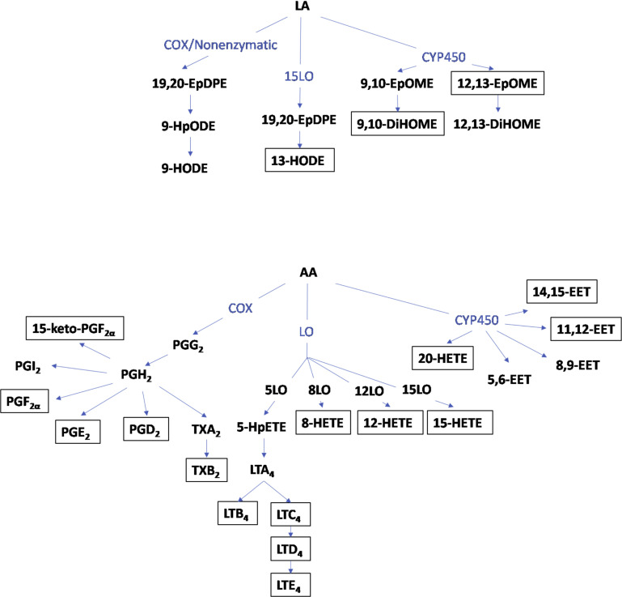
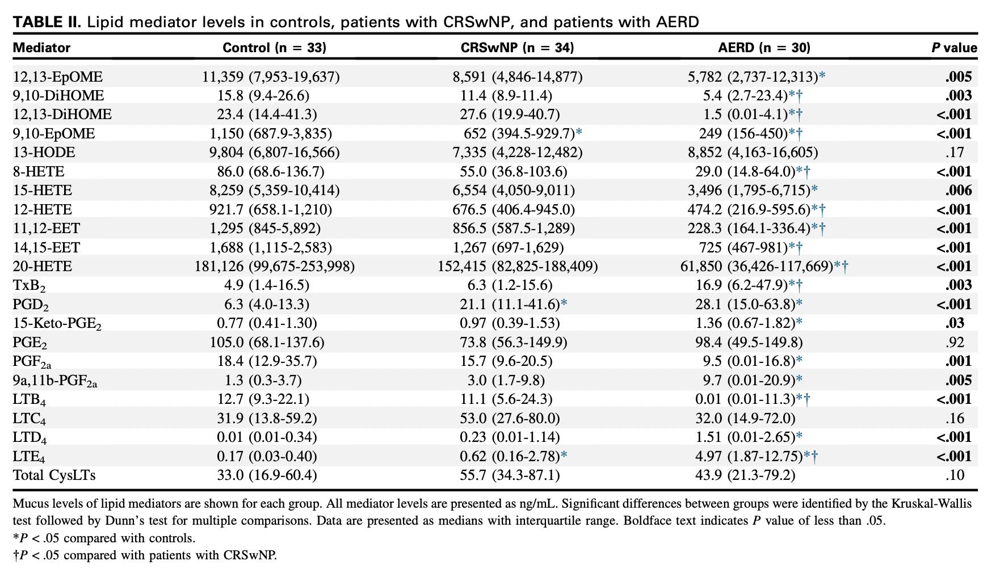

# 2022 AAAAI abstract #480
# Aspirin Exacerbated Respiratory Disease Can be Accurately Identified Using Sinonasal Mucus Lipid Biomarkers

# Abstract

Rationale: Patients with aspirin exacerbated respiratory disease (AERD) frequently present with severe chronic rhinosinusitis with nasal polyposis (CRSwNP). Prior work by our group has identified potential inflammatory subtypes of AERD in patients using mucus-derived lipid biomarkers. In this study, we hypothesized that these biomarkers could be used to non-invasively diagnose AERD.

Methods: 98 patients (34 CRSwNP, 31 AERD, and 33 controls) undergoing endoscopic sinus or skull base surgery were enrolled in a prospective longitudinal study. Arachidonic acid and linoleic acid derived lipid mediators were measured from mucus samples using liquid chromatography-mass spectrometry. Principal component logistic and multinomial regression was used to classify AERD from CRSwNP and controls using lipid biomarkers alone. Receiver operating curves were used to assess model fit. Prediction performance was assessed using a bootstrap cross-validation technique with 1000 replicates and a 70/30 train/test split.

Results: Approximately 70% of the variance was explained by the first 7 principal components. The first component was highly weighted towards 8-HETE, 12-HETE, 20-HETE, 13-HODE, PGF2a, 11,12-EET, 14,15, EET, 9,10 EpOME, 12,13 EpOME, and 9,10, DiHOME. In the two-class comparison (AERD vs non-AERD), the area-under-the-curve (AUC) of the regression model was 0.96 (95% CI 0.92-0.99). The pairwise AUC between AERD/CRSwNP was 0.903. Performance metrics on bootstrap cross-validation were robust, with average accuracy of 90.5% (95% CI 82-100%), AUC of 0.95 (95% CI 0.88 – 1.0), and F1 score of 0.93 (95% CI of 0.87-1.0).

Conclusions: Mucus derived lipid mediators can be used to accurately identify a diagnosis of AERD in patients with chronic sinusitis.

# Additional Tables/Images

## Figure 1: Key mediators within the AA metabolism pathway

 
 

## Distribution of Eicosanoids between groups

From: Scott WC, Cahill KN, Milne GL, Li P, Sheng Q, Huang LC, Dennis S, Snyder J, Bauer AM, Chandra RK, Chowdhury NI, Turner JH. Inflammatory heterogeneity in aspirin-exacerbated respiratory disease. J Allergy Clin Immunol. 2021 Apr;147(4):1318-1328.e5. doi: 10.1016/j.jaci.2020.11.001. Epub 2020 Nov 12. PMID: 33189729; PMCID: PMC8035132.

# Measurement of Eicosanoids

AA- and LA-derived lipid mediators detectable by our ultraperformance LC-MS approach were assessed in the mucus samples collected at the time of surgery. Twenty-five to 40 mL of each mucus specimen was placed into a microcentri- fuge tube containing 5000 mL 25% methanol in water and internal standard mix (1 ng each deuterated eicosanoid). The sample was vortexed and spun to pellet protein. The supernatant was then extracted on an Oasis MAX mElution plate (Waters Corp, Milford, Mass) as follows: Sample wells were first washed with methanol (200 mL) followed by 25% methanol in water (200 mL). The sample was then loaded into the well and washed with 600 mL 25% methanol. Eicos- anoids were eluted from the plate with 30 mL 2-propanol/acetonitrile (50/50, vol/vol) containing 5% formic acid into a 96-well elution plate containing 30 mL water in each well. Samples were analyzed on a Waters Xevo TQ-XS triple quadrupole mass spectrometer connected to a Waters Acquity I-Class ultraper- formance LC (Waters Corp). Separation of analytes was obtained using an Acq- uity PFP column (2.1 3 100 mm), with mobile phase A being 0.01% formic acid in water and mobile phase B acetonitrile. Eicosanoids were separated us- ing a gradient elution beginning with 30% B going to 95% B over 8 minutes at a flow rate of 0.250 mL/min.

# Funding
R21 AI142321 and R01 AG065550 to J.H.T. and grant no. K23 AI118804 to K.N.C.

Note: This page will be updated with code, examples, and links to pre-print and published manuscripts as they become available.
